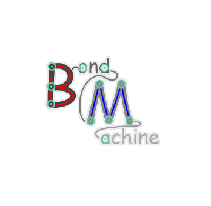

# [BondMachine](https://www.bondmachine.it)

## ***a mouldable computer architecture***

**The BondMachine** (BM) is a new kind of computer architecture radically different from the ones usually found in today's computers.  

Thei main feature of **The BondMachine** is that its processors forms an heterogeneous set of computing units where each of them can be configured and specialized to do a specific task implementing different architectures based on the specific problem.

Unlike standard architectures where software has to fit processors static constraints, within **The BondMachine** the architecture itself is build around the problem prior to creating the software. The result is a reduction of the gap between hardware and software. 

BondMachines can be created in several ways: manually with its building tools, with a set of API that target specific problems and with a set of higher level [**tools**](https://www.bondmachine.it/intro/tools) that can create architectures from a description of the problem. These tools range from an **assembler** and a dedicated **compiler** to a set of application that can be used to map **Machine Learning** and **Quantum Computing** problems to the architecture.

BondMachines can be connected together with a custom ethernet protocol called **etherbond**. Distributed clusters of heterogeneous multicore can be built this way.

Ultimately the produced BondMachines can be simulated, used as computer applications or translated to RTL code and used in hardware (for example using FPGAs).

Strictly speaking **The BondMachine** is not only the architecture itself but also all the other technologies developed to make all of this possible. It is ultimately a **computing [ecosystem](https://www.bondmachine.it/intro/ecosystem)** made of several components.
