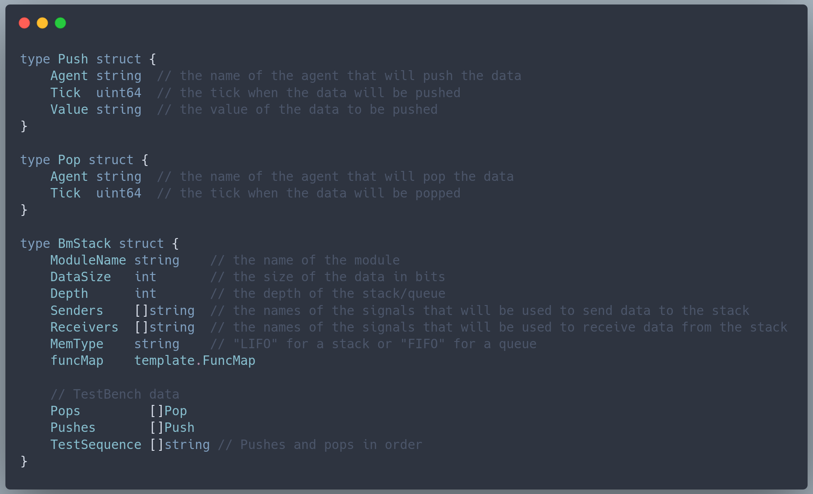
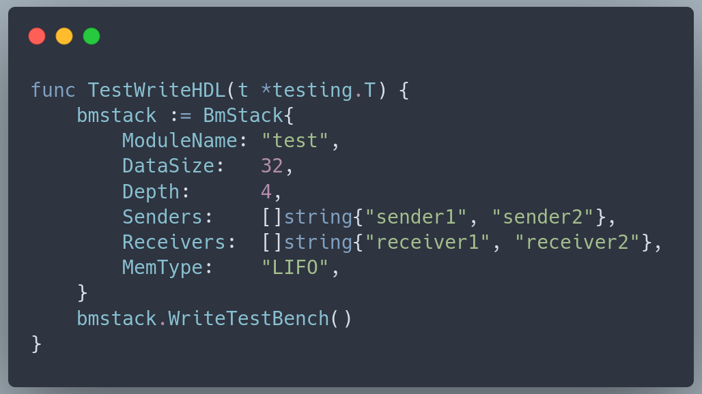

# bmstack

bmstack is part of BondMachine project. Within the project It is used to create stacks and queues distributed among several BondMachine cores. due to its generality it can also be used as standalone tool to produce HDL shared stacks and queues to be used in other projects.
The HDL code is build using golang templates that creates the code starting from the following data structure. The comments describe the meaning of each field.

The library can be used in two ways.
The first one is from a go program. After creating a BmStack object, the user can call the WriteHDL method to produce the HDL code.
An example on how the library can be used this way can be seen in the go test file (bmstack_test.go).

The second part of the stuct can be filled with test data. These data are used to produce a test bench for the stack. Using the test bench the user can verify the correctness of the stack. The test bench is produced by calling the WriteTestBench function.

the library also came with a companion CLI executable called bmstack that provides the basic interface to the library. This is the second Possibile way to use it.

WIP

To see how the library is used in the BondMachine project, please refer to the BondMachine examples directory that contains many examples of BondMachines using stacks and queues.