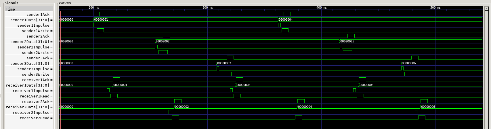

# BMStack

bmstack is part of BondMachine project. Within the project It is used to create stacks and queues distributed among several BondMachine cores. due to its generality it can also be used as standalone tool to produce HDL shared stacks and queues to be used in other projects.
The HDL code is build using golang templates that creates the code starting from the following data structure. The comments describe the meaning of each field.

```go
type Push struct {
  Agent string // The name of the agent that is pushing
  Tick  uint64 // The tick at which the push occurs
  Value string // The value that is pushed
}

type Pop struct {
  Agent string // The name of the agent that is popping
  Tick  uint64 // The tick at which the pop occurs
}

type TestBenchData struct {
  Pops         []Pop    // List of pops
  Pushes       []Push   // List of pushes
  TestSequence []string // Pushes and pops in order
}

type BmStack struct {
  ModuleName string   // The name of the module
  DataSize   int      // The size of the data bus
  Depth      int      // The depth of the stack
  Senders    []string // The names of the agents that can send data to the stack
  Receivers  []string // The names of the agents that can receive data from the stack
  MemType    string   // "LIFO" for a stack or "FIFO" for a queue
  funcMap    template.FuncMap

  // TestBench data
  TestBenchData
}
```

## Usage

### Usage: API 

The library can be used in two ways.
The first one is from a go program. After creating a BmStack structure, the user can call the WriteHDL function to produce the HDL code.
An example on how the library can be used this way can be seen in the go test file (bmstack_test.go).

```go
func TestWriteHDL(t *testing.T) {
  // Create a new stack with 4 agents
  stack := BmStack{
    ModuleName: "test",
    DataSize:   32,
    Depth:      8,
    Senders:    []string{"sender1", "sender2"},
    Receivers:  []string{"receiver1", "receiver2"},
    MemType:    "LIFO"
  }

  // write the HDL code
  stack.WriteHDL()
```

The second part of the struct can be filled with test data. These data are used to produce a test bench for the stack. Using the test bench the user can verify the correctness of the stack. The test bench is produced by calling the WriteTestBench function.

```go
func TestWriteTestBench(t *testing.T) {
  stack := BmStack{
  // ...
    s.Pushes = []Push{
      Push{"sender1", 200, "32'd1"},
    }
    s.Pops = []Pop{
      Pop{"receiver1", 60},
    }
  }
  // write the test bench
  stack.WriteTestBench()
}
```

The two functions (WriteHDL and WriteTestBench) return a string that contains the HDL code or an error if something went wrong (string, error).
The provided go test file (bmstack_test.go) shows how the library can be used in this way. When invoked (go test), it produces the two files (bmstack.v and bmstack_tb.v).
This kind of usage is useful when the user needs to create a stack or a queue in HDL and then use it in a bigger project like it is done in the BondMachine project.

### Usage: CLI

The library also came with a companion CLI executable called bmstack that provides the basic interface to the library. This is the second Possible way to use it.
With the -h flag the user can see the available options and their meaning.

```bash
$ bmstack -h
Usage of bmstack:
  -d    Verbose
  -data-width int
        Width of the data bus (default 32)
  -depth int
        Depth of the stack/queue (default 8)
  -hdl-file string
        Name of the file to write the HDL to (empty string to disable) (default "stack.v")
  -memory-type string
        Memory type, either stack or queue (default "queue")
  -random-stimulus int
        Generate random stimulus including N pushes and pops for every agent (0 to disable)
  -receivers string
        Comma separated list of names of signal tags that will receive data from the stack/queue
  -senders string
        Comma separated list of names of signal tags that will send data to the stack/queue
  -sim-length int
        Length of the simulation in clock cycles (default 1000)
  -stimulus-file string
        Name of the JSON file to load the stimulus from (empty string to disable)
  -tb-file string
        Name of the file to write the testbench to (empty string to disable)
  -v    Verbose
```

## Examples

Within the BondMachine project, the library is used to create stacks and queues in HDL whenever needed. Some example of this are:

- The queue used by the thread manager in the CP cores to store the CP threads state
- The stack used to store the return addresses in the call instruction
- The queue used to get data for the keyboard

To further see how the library is used in the BondMachine project, please refer to the BondMachine examples directory that contains many examples of BondMachines using stacks and queues. Instead, here we provide a simple example of how to use the library as standalone tool.

### Example: API

The provided go test file (bmstack_test.go) shows how the library can be used in this way. When invoked (go test), it produces the two files (bmstack.v and bmstack_tb.v).

```bash
$ go test
$ ls *.v
bmstack_tb.v  bmstack.v
```

This example sets up a stack with 5 agents (3 senders and 2 receivers) and then produces the HDL code and the test bench for the stack. The test bench contains a sequence of pushes and pops that are used to verify the correctness of the stack.
In detail the 3 senders push 6 values (2 each) to the stack at different times, while the 2 receivers pop the 6 values (3 each) from the stack at different times. The 6 values are distributed among the 2 receivers.

### Example: CLI

The CLI can be used to produce the HDL code and the test bench for the stack. The following command produces the exact same file (bmsta.v) as the API example above.

```bash
$ bmstack -senders sender1,sender2,sender3 -receivers receiver1,receiver2 -hdl-file bmstack.v
```

To also produce the (same) test bench, the user can use the following command.

```bash
$ bmstack -senders sender1,sender2,sender3 -receivers receiver1,receiver2 -hdl-file bmstack.v -tb-file bmstack_tb.v -stimulus-file stimulus.json
```

Where `stimulus.json` is a JSON file that contains the test bench data. The JSON file has the following format.

```json
{
  "Pops": [
    {"Agent": "receiver1","Tick": 110},
    {"Agent": "receiver2","Tick": 160},
    {"Agent": "receiver1","Tick": 210},
    {"Agent": "receiver2","Tick": 260},
    {"Agent": "receiver1","Tick": 310},
    {"Agent": "receiver2","Tick": 360}
  ],
  "Pushes": [
    {"Agent": "sender1","Tick": 100,"Value": "32'd1"},
    {"Agent": "sender2","Tick": 150,"Value": "32'd2"},
    {"Agent": "sender3","Tick": 200,"Value": "32'd3"},
    {"Agent": "sender1","Tick": 250,"Value": "32'd4"},
    {"Agent": "sender2","Tick": 300,"Value": "32'd5"},
    {"Agent": "sender3","Tick": 350,"Value": "32'd6"}
  ],
  "TestSequence": null
}
```

The JSON file contains the same data as the test bench data in the API example above. The user can use the JSON file to provide his own test bench data to the CLI. With -random-stimulus the user can also generate random stimulus data for the test bench.
The CLI can be used to produce the HDL code and the test bench for a custom distributed stack/queue to use in other projects.

`Warning`: If the simulation prints a message like
```
Warning: impulse while request is active, the impulse will be ignored
```

it is due to the fact that the test bench data is not correct. Some pops/pushes are fired while the stack has already a request active from the same agent. In a real scenario, the agent would wait for the ack signal before sending another request.
The test bench provided in the example is correct.

## Simulation

Whether the HDL code is produced using the API or the CLI, the user can simulate the stack/queue using the provided test bench. The test bench is written in Verilog and can be simulated using any Verilog simulator. Here we provide an example using the Icarus Verilog simulator to run the simulation. The simulation produces a vcd file that can be viewed using gtkwave.

Following the API example above, the user can simulate the stack using the following commands.

```bash
$ iverilog -o bmstack.vvp *.v
$ vvp bmstack.vvp
VCD info: dumpfile bmstack.vcd opened for output.
stack_tb.v:142: $finish called at 1304000 (1ps)
$ gtkwave bmstack.vcd
```



The simulation shows the stack in action. The stack is filled with 6 values and then the values are popped by the receivers. The values are distributed among the two receivers as expected. Alongside the values pushed and popped, the simulation also shows some internal signals of the stack.

## Interface

To use the generated HDL code, the user needs to connect the stack/queue to the agents that send and receive data. The stack/queue has the following interface.

### Senders

The senders need to connect the following signals to the stack/queue.

- `clk`: The clock signal
- `reset`: The reset signal
- `[sendername]Data`: The data to be pushed to the stack/queue
- `[sendername]Write`: The write signal to push the data to the stack/queue
- `[sendername]Ack`: The acknowledge signal to confirm the data has been pushed to the stack/queue

So, for example, if the user has a sender agent called sender1, the user needs to write the data to be pushed to the stack/queue in the `sender1Data` signal, then set the `sender1Write` signal to 1 to push the data to the stack/queue. The `sender1Ack` signal will be set to 1 when the data has been pushed to the stack/queue.

Sendername is the name of the sender agent chosen by the user.

### Receivers

Similarly, the receivers need to connect the following signals to the stack/queue.

- `clk`: The clock signal
- `reset`: The reset signal
- `[receivername]Data`: The data to be popped from the stack/queue
- `[receivername]Read`: The read signal to pop the data from the stack/queue
- `[receivername]Ack`: The acknowledge signal to confirm the data has been popped from the stack/queue

So, for example, if the user has a receiver agent called receiver1, the user needs to set the `receiver1Read` signal to 1 to pop the data from the stack/queue. The `receiver1Data` signal will contain the data popped from the stack/queue. The `receiver1Ack` signal will be set to 1 when the data has been popped from the stack/queue and is available in the `receiver1Data` signal.
